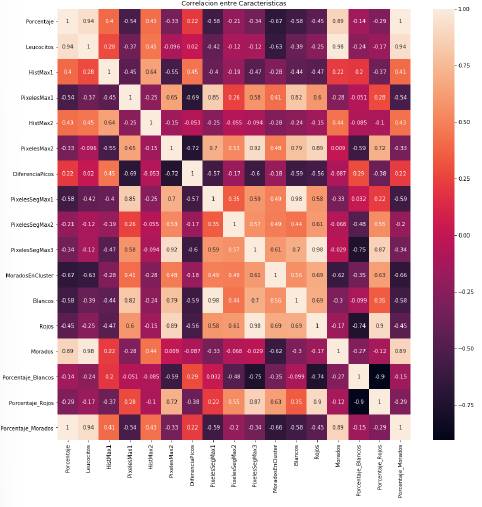

# Automatic image analysis of peripheral blood smears for the diagnosis of leukaemia
##### Hodei Zia Lopez

## Brief Introduction
This project is about how to detect leukaemia in a quick and inexpensive way so that it can be accessible to everyone. To do this, we would only need a sample of the patient's blood with which to apply a peripheral blood smear to obtain valid samples for analysis. Then, after obtaining these samples, we would apply computer vision and machine learning techniques to classify them. If any of the patient's samples were classified as "leukaemia", we would notify the patient so that he or she could start treatment as soon as possible. In addition, in order to improve our dataset, as long as the patient allows us to do so, and after the diagnosis by the health services, we would add the samples to our dataset. To facilitate the work in future improvements and to better analyse the results, we will create a database managed by a graphical interface, where we will store all the data obtained after each test of the code.

## What is leukaemia?
Leukaemia is one of the three main types of blood cancer. The disease begins in the soft tissue in the bones, where blood cells are formed, called bone marrow.
The bone marrow, as we have already mentioned, is responsible for generating all the blood cells necessary for the correct functioning of the human body. These cells include:
- Red blood cells or red blood cells. They are responsible for carrying oxygen to the cells.
- White blood cells or leukocytes. They defend us from infections and other diseases.
- Platelets. They prevent bleeding by forming a clot around wounds.

In this disease, the bone marrow produces abnormal white blood cells in uncontrollable numbers, which are called leukaemic blast cells or more commonly leukaemia cells.
These cancer cells are able to divide by reproducing themselves and avoid dying as they age or become damaged, thus preventing the proper reproduction of other blood cells (including healthy white blood cells) by accumulating in the bloodstream.

Leukaemias can be classified in two ways according to different characteristics.
#### 1. According to the speed at which the disease progresses:
- Acute: Occurs at high speed. Most of the reproducing white blood cells are immature.
- Chronic: Produced very slowly. The cancer cells start out behaving correctly, which makes them harder to detect. As time passes, they block the reproduction of other blood cells until they eventually become the majority.
#### 2. Depending on the type of cell they affect:
- Myeloid: Starts in myeloid cells.
- Lymphoid: begins in the lymphoid cells.
Thus, we can distinguish four types of leukaemia:
- Acute myeloid leukaemia (AML): affects myeloid cells and develops very quickly. It occurs in older people, although it can also affect adolescents.
- Chronic myeloid leukaemia (CML): Starts slowly affecting myeloid cells. Like AML, it affects older people, but can also affect adolescents.
- Acute lymphoblastic leukaemia (ALL): Affects lymphoid cells and develops at a faster rate. It affects young people between 2 and 5 years of age.
- Chronic lymphocytic leukaemia (CLL): Starts slowly affecting the lymphoid cells. Unlike ALL, this type of leukaemia affects mostly older people and very rarely young people.

In this project, we will discuss acute lymphoblastic leukaemia or ALL.

## Techniques used

For the realisation of the project, I have used different Computer Vision techniques:
- Colour space conversions.
- Region-based segmentation
- Pixel intensity processing
- Geometric shape detection
- Image reduction
- Pixel recolouring

In addition to these techniques, I have also applied different classifiers such as:
- KNN
- Decision trees
- Logistic Regression
- Neural Networks
- SVM
- Random Forest

All these techniques and classifiers are detailed in the memory.

## The Idea
The idea starts with a pre-processing of each of the images in the dataset so that we can extract all the relevant features as well as reconvert the images so that we can more easily detect which are the problem lymphocytes and in which samples they are found.

### Example
Starting from an image, let's make an example of a sample segmentation.

We will remove the background using a mask on the image that takes into account the HSV colour space, where we will filter by the predominant shades of the lymphocytes. Once we have only the lymphocytes, we will treat the edges for them, so that the computer will be able to identify how many there are and where they are. 

In this way we were able to extract very important characteristics for each sample: number and location of lymphocytes and percentage of background.

In addition to this, we can also take into account the amount of red blood cells in each sample, since the lower the amount, the higher the probability of being sick (the opposite of lymphocytes). To do this, other changes are applied to the image in order to extract other characteristics such as the amount of space the red blood cells have, the amount of background space, the amount of lymphocytes, their tonalities... We do this by applying a K-Means with K=3 together with the mask.

## Results

Once we have the 17 variables extracted from the images, we are going to classify the samples with the different classifiers already mentioned.

### With the Default Hyperparameters with the 17 Variables

|                         	|                    	|                   	|            	|
|-------------------------	|--------------------	|-------------------	|------------	|
| **Classifier**          	| **Train Accuracy** 	| **Test Accuracy** 	| **FScore** 	|
| **KNN**                 	| 100.00%            	| 96.96%            	| 95.84%     	|
| **Decision Trees**      	| 100.00%            	| 100.00%           	| 100.00%    	|
| **Random Forest**       	| 100.00%            	| 96.96%            	| 95.84%     	|
| **Logistic Regression** 	| 100.00%            	| 100.00%           	| 100.00%    	|
| **SVM**                 	| 84.00%             	| 84.84%            	| 88.88%     	|
| **Neural Networks**     	| 58.66%             	| 45.45%            	| 0.00%      	|

### Applying a GridSearch with the 17 Variables

|                         	|                    	|                   	|            	|
|-------------------------	|--------------------	|-------------------	|------------	|
| **Classifier**          	| **Train Accuracy** 	| **Test Accuracy** 	| **FScore** 	|
| **KNN**                 	| 99.09%            	| 99.09%            	| 99.09%     	|
| **Decision Trees**      	| 99.09%            	| 99.09%            	| 99.09%    	|
| **Random Forest**       	| 100.00%            	| 100.00%            	| 100.00%    	|
| **Logistic Regression** 	| 99.09%            	| 99.09%            	| 99.09%    	|
| **SVM**                 	| 99.09%             	| 99.09%            	| 100.00%     |
| **Neural Networks**     	| 100.00%            	| 99.09%            	| 99.09%     	|

We see how the results are incredible when applying a GridSearch that takes care of finding the best combination of hyperparameters for each classifier.

However, we still have too many variables, so we will try to reduce them.
Para ello comenzaremos con una seleccion de variables utilizando las medidas de calidad Chi2 y Anova seleccionando las K-Best combinaciones de variables.

| **Quality Measure** 	| **Train Accuracy** 	| **Test Accuracy** 	| **# Variables** 	|
|---------------------	|--------------------	|-------------------	|-----------------	|
| **Chi2**            	| 98.66%             	| 100.00%           	| 6               	|
| **Anova**           	| 98.66%             	| 100.00%           	| 3               	|

In addition to the filters, we will also use a PCA and a search for correlations between variables to apply the reduction. On the other hand, we will analyse the SHAP Values to achieve the same objective.

### Feature Importance and SHAP Values

If we look at the importance of each of the 17 initial variables, we see that there are very large differences:

### PCA

With a PCA, we see how we only need two variables to reach 98.66% in train and 100.00% in test.

### Correlation Matrix

As for the search for correlations, we decided to eliminate all correlations above 0.8 (or below -0.8). This brings us down from the initial 17 variables to 9.

Finally, leaving only the 9 variables that we have seen to be most different from each other, we obtain the following results:

|                         	|                    	|                   	|            	|
|-------------------------	|--------------------	|-------------------	|------------	|
| **Classifier**          	| **Train Accuracy** 	| **Test Accuracy** 	| **FScore** 	|
| **KNN**                 	| 90.72%            	| 99.09%            	| 99.09%     	|
| **Decision Trees**      	| 98.18%            	| 98.18%            	| 98.18%    	|
| **Random Forest**       	| 100.00%            	| 100.00%            	| 100.00%    	|
| **Logistic Regression** 	| 90.45%            	| 99.09%            	| 99.09%    	|
| **SVM**                 	| 86.00%             	| 99.09%            	| 100.00%     |
| **Neural Networks**     	| 82.45%            	| 99.09%            	| 99.09%     	|

It is clear that we only worsen the train accuracy, leaving the test accuracy and fscore untouched, so applying this reduction is convenient.

## The Database
To facilitate data capture and test documentation, a relational database has been designed and populated with around 3500 data points at present. Its structure is as follows:

## The User Interface
We have not only created a database. In order to make it easier to use, and thinking a bit about those who do not know programming, we have also created a user interface with which to document everything mentioned above in a much simpler way. In addition, you can get reports of everything stored in the database in .txt format.

## Final tests with Deep Learning
In addition to all of the above, we have decided to repeat everything using Deep Learning with different data resolutions so that we can see if we need too much resolution or too little. 

The results have shown that by dropping from 1944x1458 to 615x461 we still maintain 100.00% in both test and train.

## Brief Conclusions

- It's not all about the hit rate.
- Deep Learning works very well with images.
- Not all errors are the same.

## Future Directions I would like to test
- Make these analyses easily accessible to everyone.
- Detect the disease before it spreads.
- Detect which types of white blood cells are most associated with the disease.
- Reduce the combinatorics of Grid Search hyperparameters.
- Increase the dataset with real samples.
- Work in the field to improve the project and try to implement it.

If you have any questions, please do not hesitate to contact me by [e-mail](mailto:hodei54@gmail.com):incoming_envelope:
